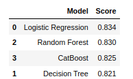

# Titanic
###### This project was completed in Week 2 of the Data Science bootcamp at SPICED Academy.
In this project, I built and trained different classification models (***Logistic Regression, Random Forest, Decision Tree, CatBoost***) on Titanic data set, in order to predict whether passengers would survive on Titanic based on their gender, cabin, family,ticket price, ect.
Logistic Regression gave the highest accuracy score. 
